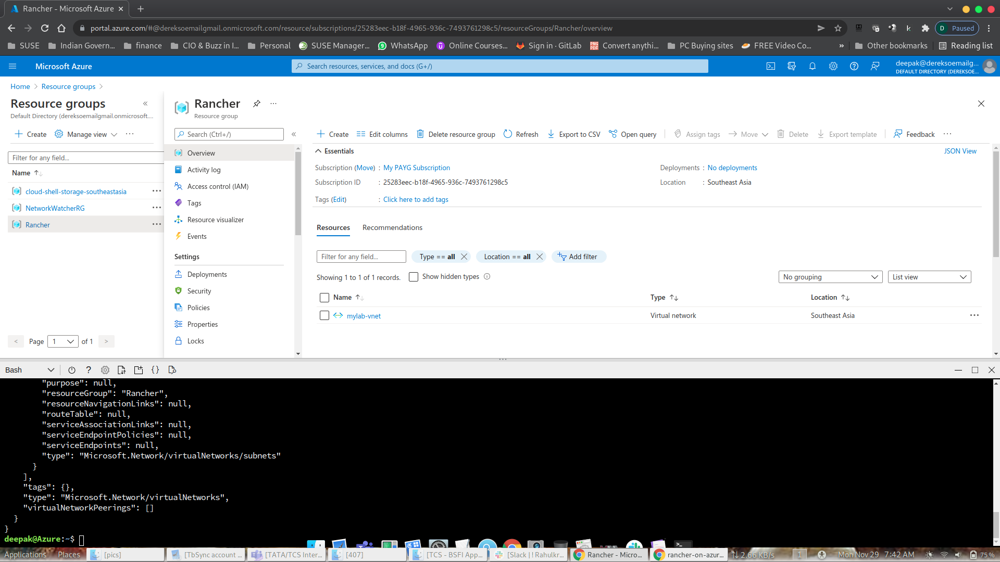
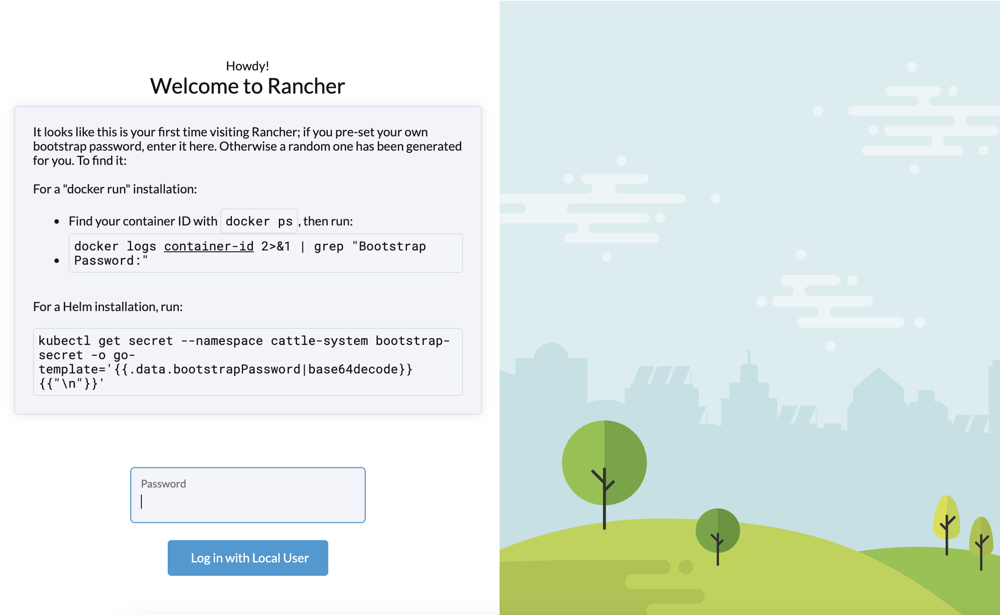
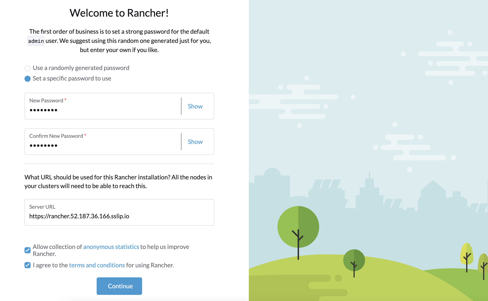

# Exercise 1: Install SUSE Rancher on Microsoft Azure Instance

Duration: 30 minutes

At this point, we are going to setup an instance of SUSE Rancher Server on Azure.


# Express Way for Task 1 & 2

**TIPS**: If you want to setup the Rancher Server on Azure automatically (task 1 and 2), we have prepared a script for you. To do this, please follow the steps below.

1. Open Azure Cloud Shell
2. In the Cloud Shell bash terminal, run the following command.

```bash
git clone https://github.com/dsohk/rancher-on-azure-workshop/
cd rancher-on-azure-workshop/scripts
```


3. Run the command to create a resource group on Azure, deploy a VM within this group and install Rancher Server on this VM. This step will take about 10-15 mins to finish.

```bash
./startlab.sh
```


Once done, you can proceed to Task 3.

## Task 3 - Login to Rancher Server

1. Open a browser and navigate to the Rancher Server URL. Type **thisisunsafe** at the page where there's invalid SSL warning to continue. You will be leading to a first-time setup page of Rancher like below. Enter your bootstrap password to continue..


2. Set your own password.


3. Successful Login and Rancher Homepage.


All above steps can be also performed in regular way. 

# Regular Way for Task 1 & 2

**TIPS**: If you want to understand better the steps required to setup Rancher Server on Azure Instance, please follow the steps outlined in this section as follows.

## Task 1: Create a Linux Instance on Azure

In this task, let's create a linux instance on Azure to run SUSE Rancher.

**NOTE**: Please open **Azure Cloud Shell** to operate this exercise.

### Create Resource Group and a virtual network

First, create a resource group nearest to where you are.

```bash
az group create --name lab --location southeastasia
```

Sample Azure Portal Image



Let's create a default virtual network named **mylab-vnet** with the a subnet to host Rancher VM instance in this workshop.

```bash
az network vnet create --resource-group lab \
  --name lab-vnet --address-prefix 10.0.0.0/16 \
  --subnet-name rancher-subnet --subnet-prefix 10.0.0.0/24
```


### Create a Linux virtual machine using OpenSUSE Leap 15.3

Create an OpenSUSE Leap 15.3 Linux virtual machine instance attached to the rancher-subnet network. We will deploy Rancher Server on this VM.

```bash
az vm create --resource-group lab \
  --name rancher \
  --admin-username suse \
  --image SUSE:opensuse-leap-15-3:gen1:2021.10.12 \
  --size Standard_B4ms \
  --generate-ssh-keys \
  --public-ip-sku Basic \
  --vnet-name lab-vnet \
  --subnet rancher-subnet \
  --os-disk-size-gb 50 \
  --verbose 
```

It takes a 2-3 minutes to create this VM and supporting resources. The following example output shows the VM create operation was successful.

```
{
  "fqdns": "",
  "id": "/subscriptions/25283eec-b18f-4965-936c-7493761298c5/resourceGroups/Rancher/providers/Microsoft.Compute/virtualMachines/rancher",
  "location": "southeastasia",
  "macAddress": "00-0D-3A-A0-DA-67",
  "powerState": "VM running",
  "privateIpAddress": "10.0.0.4",
  "publicIpAddress": "20.212.112.32",
  "resourceGroup": "Rancher",
  "zones": ""
}
Command ran in 92.491 seconds (init: 0.115, invoke: 92.376)
```


### Open port 443 for web traffic

By default, only SSH connections are opened when you create a Linux VM in Azure.  Let's configure this VM to open TCP port 443 (https protocol) for use with Rancher Server instance:

```bash
az vm open-port --port 443 --resource-group lab --name rancher
```


### Connect to virtual machine

SSH to your VM as usual. Use the public IP address of your VM as noted in the previous output in your ssh command. Alternatively, use the script below to obtain the VM IP address and ssh into it.

```bash
export RANCHER_IP=$(az vm show -d -g lab -n rancher --query publicIps -o tsv)
ssh -o StrictHostKeyChecking=no suse@$RANCHER_IP
```

A new command prompt `suse@rancher:~>` should be shown as example below, indicating you have connected to the virtual machine successfully.

```
openSUSE Leap 15.3 x86_64 (64-bit)

If you are using extensions consider to enable the auto-update feature
of the extension agent and restarting the service. As root execute:

  - sed -i s/AutoUpdate.Enabled=n/AutoUpdate.Enabled=y/ /etc/waagent.conf
  - rcwaagent restart

As "root" use the:

- zypper command for package management
- yast command for configuration management

Have a lot of fun...
suse@rancher:~>
```


## Task 2: Install Rancher Server on Azure VM

In this task, you are going to run the scripts provided in the `rancher` virtual machine terminal. SSH into this VM as instructed in Task 1 if you have not done yet.

### Install software required for running script

Install the software required to execute the Rancher installation script.

```bash
sudo zypper install -y git jq
```

### Download Rancher installation script

```bash
git clone https://github.com/dsohk/rancher-on-azure-workshop/
cd rancher-on-azure-workshop/scripts
```

### Install Rancher Server

```bash
./install-rancher.sh
```

This script will
* Install Kubernetes tools (kubectl and helm),
* Deploy RKE2 cluster
* Deploy Rancher Server on the RKE2 cluster with helm chart

In about 5-10 minutes, your Rancher Server should be ready. If you see the example output shown below, this means you have successfully deployed Rancher Server on the virtual machine. Note down the Rancher URL and initial bootstrap password.

```
---------------------------------------------------------
Your Rancher Server is ready.

Your Rancher Server URL: https://rancher.52.187.36.166.sslip.io
Bootstrap Password: xk5rxg9grjrf9522752t4rqd84b46krhg86mwgvtvbzsdw49bjlzmb
---------------------------------------------------------
```


## Task 3 - Login to Rancher Server

Open a browser and navigate to the Rancher Server URL. Type **thisisunsafe** at the page where there's invalid SSL warning to continue. You will be leading to a first-time setup page of Rancher like below. Enter your bootstrap password to continue.



Then, setup your own password, accept the default Server URL and agree the terms and conditions for using Rancher on the next page to continue.



You can then land on the **Home** page of Rancher Server.


### Next steps

In this exercise, you deployed Rancher Server instance. In the next exercise, you will configure Rancher Server to create a few VMs on Azure and automate provisioning of a Kubernetes cluster, which integrates with Azure Load Balancer, on these VMs.

Now, you can move ahead to the [second exercise](./02-Provision-Kubernetes.md) of the lab.


