# Exercise 2: Provision Kubernetes on Microsoft Azure within SUSE Rancher

Duration: 60 minutes

At this point, you will configure Rancher to automate VM provisioning on Azure and then deploy Kubernetes on these VMs. We are going to provision a RKE2 cluster using Cluster API within SUSE Rancher.

## Task 1: Provision RKE2 on Azure VMs

Let's configure Rancher and provision a Kubernetes cluster (RKE2) of 2 VMs (one master node and one worker node) on the same Resource Group where the Rancher Server is running on. 


1. Click the top left 3-line bar icon to expand the navigation menu. Click **Cluster Management** menu item.

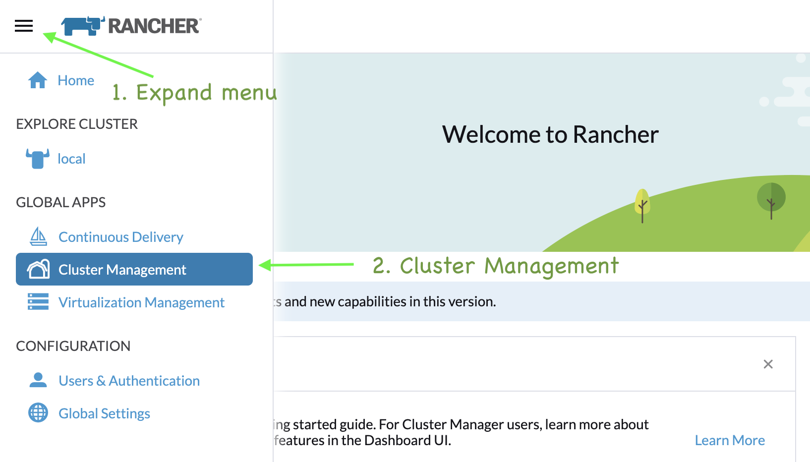


2. Choose **Clusters** in the left side menu, click **Create** button on the right to create a new Kubernetes cluster.


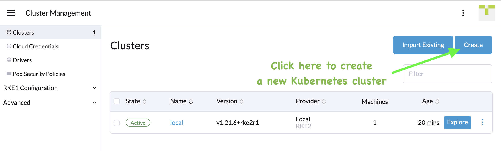


3. On **Create Cluster** page, toggle the switch to indcate that we are going to deploy RKE2. Then, choose **Azure** to continue.


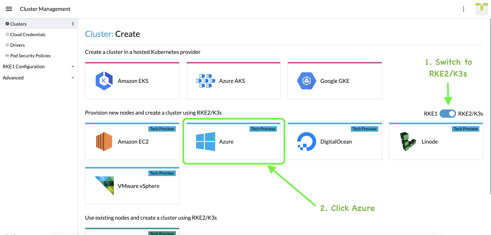


4. At this point, we need to configure Rancher to be able to automate provisioning on Azure with a proper cloud credential. Fill in the form with your own credential, which can be found in the **Environment Details** > **Service Principal Details** tab in your lab instruction section.
   - Subscription ID: (See lab manual instruction)
   - Client ID: (See lab manual instruction)
   - Client Secret: (See lab manual instruction)


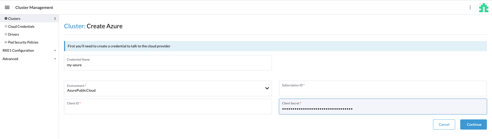

5. You will now be shown a Create Cluster on Azure form. We are going to name the cluster, create 2 machine pools for it (one for master node pool and one for worker nodes pool), and configure Azure cloud provider for this cluster.
5.  Fill in the form with details below for MachinePool - Master

- Cluster name: **rke2**

- Setup 2 Machine Pools

  - Pool Name: **master**
    - Machine Count: **1**
    - Roles: **etcd, Control Plane**
    - Location: **SouthEastAsia**
    - Resource Group: **lab**
    - Availability Set: **master**
    - Image: **SUSE:opensuse-leap-15-3:gen1:2021.10.12**
    - VM Size: **Standard_A4_v2**

  MachinePool - Master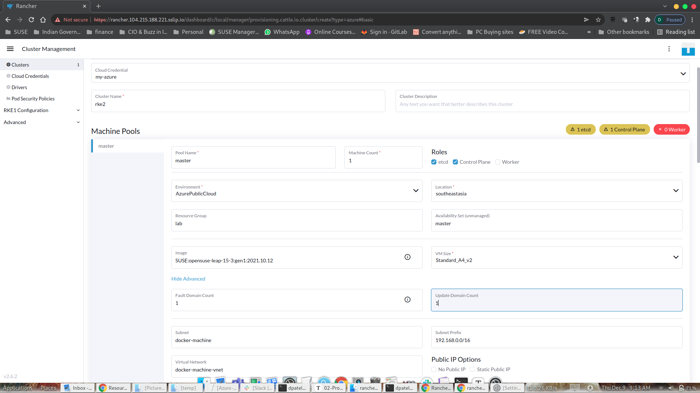

  (Show Advanced)

  - Fault Domain Count: **1**
  - Update Domain Count: **1**
  - Subnet: **master**
  - Subnet Prefix: **10.0.1.0/24**
  - Virtual Network: **lab-vnet**
  - Network Security Group: **master**
  - Use Managed Disks: **checked**

  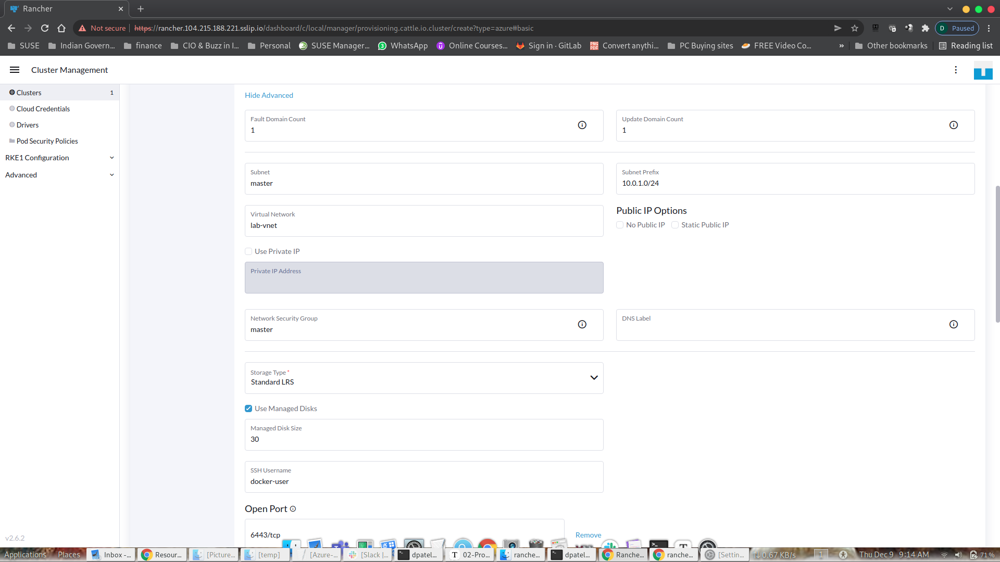

  

  - Click on the '+' sign to create 1 more machine pool. This would be for the workers. 

  ​	Fill in the form with details below for MachinePool - Worker

  - Pool Name: **worker**
    - Machine Count: **1**
    - Roles: **Worker**
    - Location: **SouthEastAsia**
    - Resource Group: **lab**
    - Availability Set: **worker**
    - Image: **SUSE:opensuse-leap-15-3:gen1:2021.10.12**
    - VM Size: **Standard_A4_v2**
    - (Show Advanced)
      - Fault Domain Count: **1**
      - Update Domain Count: **1**
      - Subnet: **worker**
      - Subnet Prefix: **10.0.2.0/24**
      - Virtual Network: **lab-vnet**
      - Network Security Group: **worker**
      - Use Managed Disks: **checked**
      - Add Open Port
        - **30000-32767/tcp

  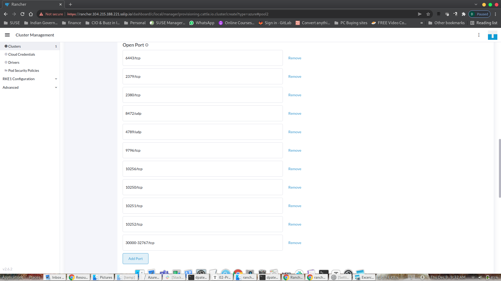

**NOTE:** In this lab, we are going to expose all applications as high port in worker nodes for public access. This requires open up firewall rules for these. For the sake of convenience, we expose a wide range of ports (30000-32767) used by Kubernetes NodePort service to the public in this lab. We suggest you open only the ports you need or use ingress controller/load balancer to expose your applications to the internet in production use. 

Scroll down to the **Cluster Configuration** section, 

Under the  **Basics** section, choose **Cloud Provider** as **Azure**. In the given **Cloud Provider Config** field, please paste the configuration from the command line. For details of this configuration, please refer to the [Azure Cloud Provider](https://kubernetes-sigs.github.io/cloud-provider-azure/install/configs/) documentation site.

** NOTE** Please use the template below for your own cloud config file. You MUST replace the following fields with your own credentials instructed in the lab, before you copy and paste this cloud config json file into the Cloud Provider config input field on Rancher web form.

  * tenantId
  * aadClientId
  * aadClientSecret
  * subscriptionId
  * 

```
cd rancher-on-azure-workshop/scripts
./generate-cloud-provider-json.sh
```

You can now copy & paste the code output. 

```
{
    "cloud": "AzurePublicCloud",
    "tenantId": "my-tenant-id",
    "aadClientId": "my-client-id",
    "aadClientSecret": "my-secret",
    "subscriptionId": "my-subscription-id",
    "resourceGroup": "lab",
    "location": "southeastasia",
    "subnetName": "worker",
    "securityGroupName": "worker",
    "securityGroupResourceGroup": "lab",
    "vnetName": "mylab-vnet",
    "vnetResourceGroup": "lab",
    "primaryAvailabilitySetName": "worker",
    "routeTableResourceGroup": "lab",
    "cloudProviderBackOff": false,
    "useManagedIdentityExtension": false,
    "useInstanceMetadata": true,
    "loadBalancerName": "rke2-lb",
    "loadBalancerSku": "basic"    
}
```

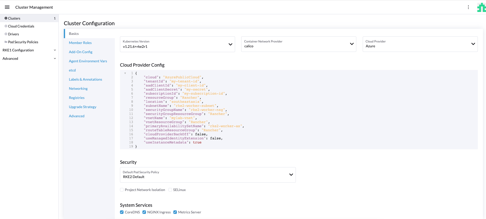


- Under **Advanced** section, add **Additional Controller Manager Args** with the line below. (See Rancher Issue [#34367](https://github.com/rancher/rancher/issues/34367))

```
--configure-cloud-routes=false
```

​		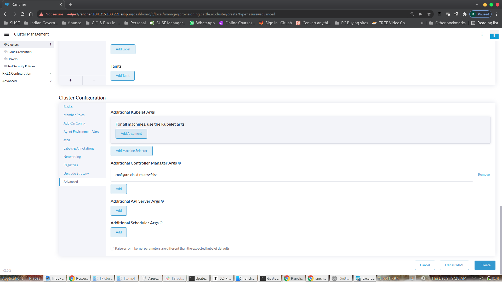

- Click **Create** button to start provisioning.

In about 10-15 mins, the RKE2 cluster will then be provisioned and setup. If you click on the cluster name `rke` in the cluster list, you will see 2 VMs are being provisioned by Rancher for building up this cluster.

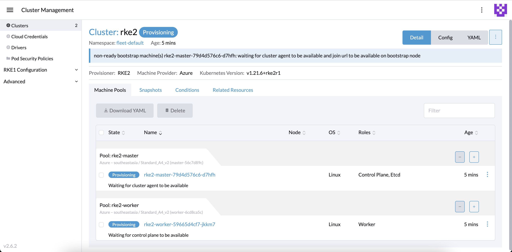

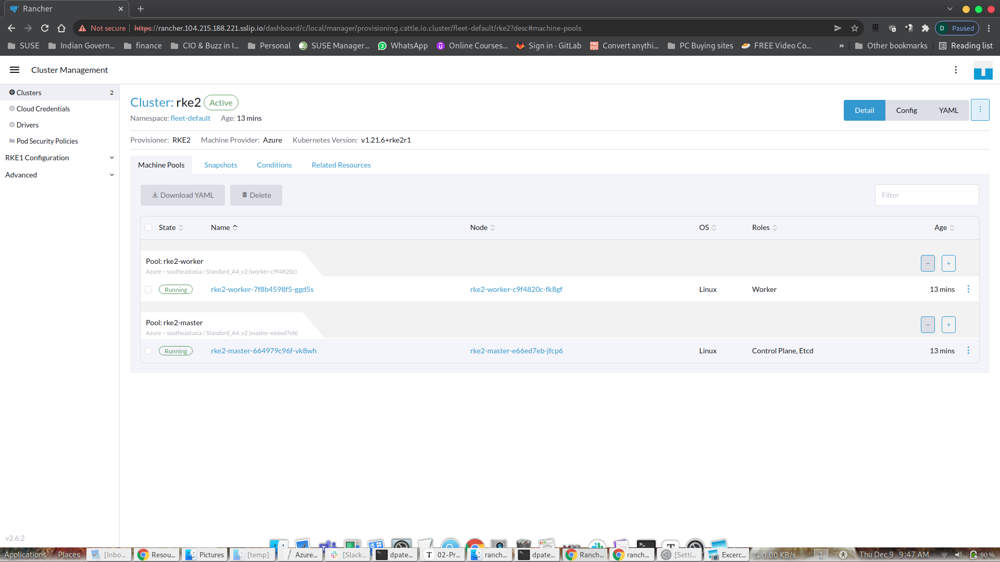

## Task 3: Observe the RKE2 Provisioning Process (help troubleshooting)

While the RKE2 starts provisioning, Rancher spins up pods under `fleet-default` namespace in the cluster, named  `local` where Rancher Server is running,to provision VMs in Azure for RKE2. We can view the logs in these pods via Rancher web interface to inspect the Azure API calls from Rancher. 

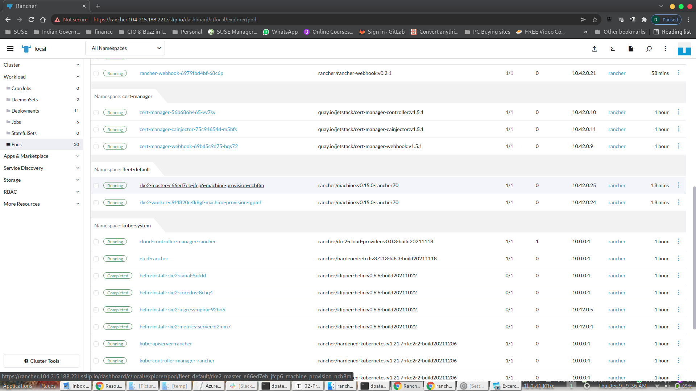

Once the machines have completed provisioning, Rancher will automatically provision RKE2 onto the VM. At this point, you can then ssh into the master and worker node within Rancher to inspect what's going on. All these are done by the `rancher-system-agent`.

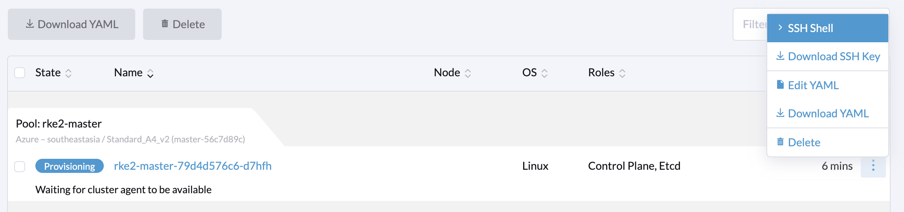


Run the following command to view the system logs in the SSH shell web console of the master node.

```bash
sudo journalctl -f
```

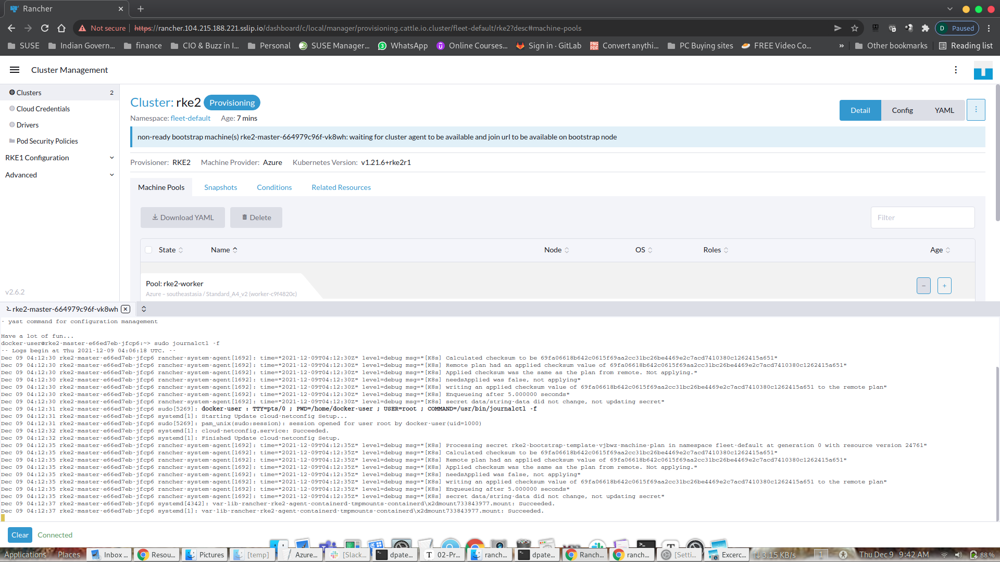

Similarly, you can view the system logs via the SSH shell web console of worker node

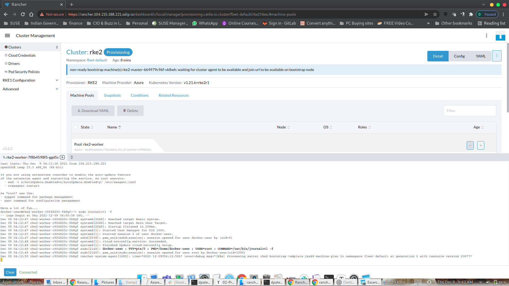

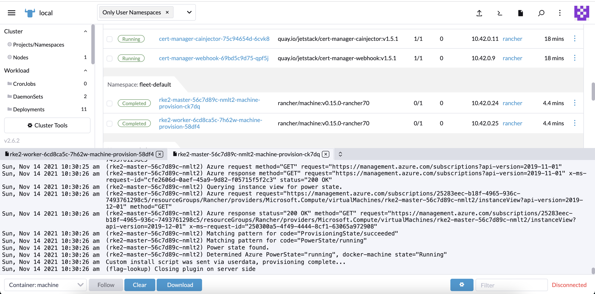

The whole RKE2 cluster creation process, from VM provisioning to RKE2 deployment, may take 10-15 mins to complete.

## Task 4: Add New Worker Node on RKE2

Let's add a new worker node on RKE2. In the machine list of the RKE2 cluster detail page, click the + button in the worker pool section. Rancher will then automatically provision a new virtual machine within the same worker node pool and join the new node as part of the RKE2 cluster.

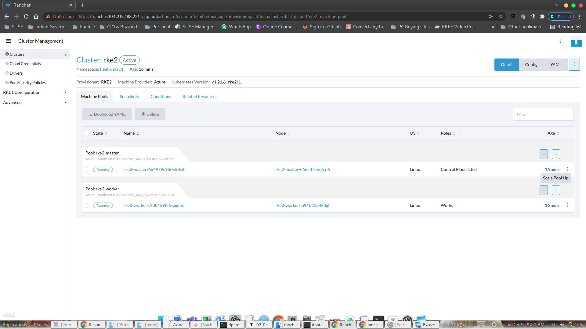

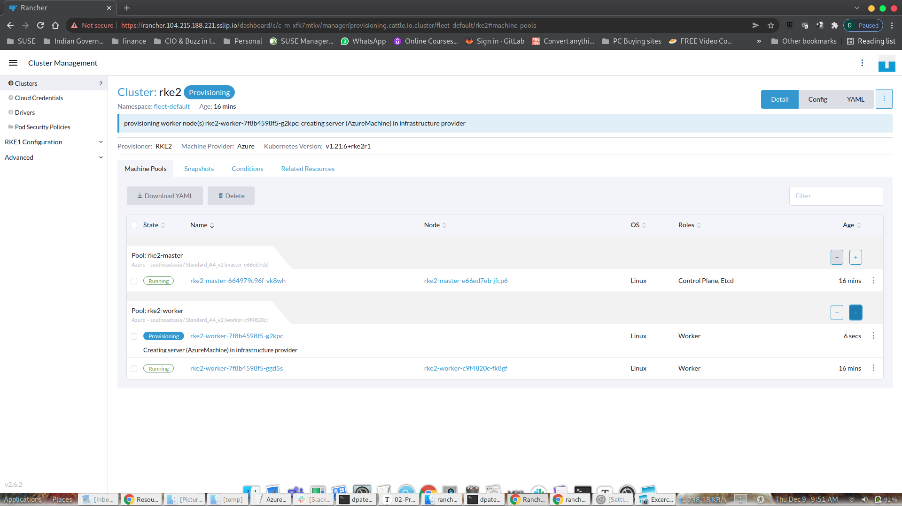

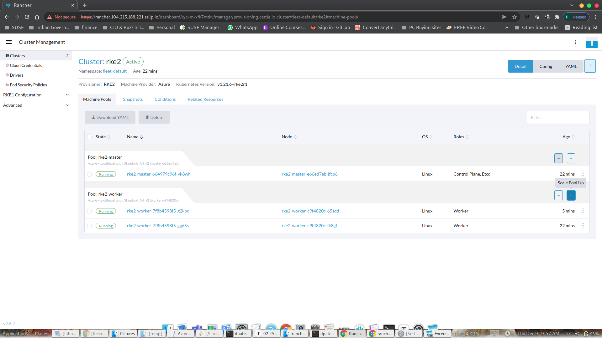

### Next steps

In this exercise, you deployed a Kubernetes cluster (RKE2) within SUSE Rancher. We also learned how to examine the logs of the cluster nodes. In the next section, we are going to deploy applications onto the RKE2 cluster.

Now, you can move ahead to the [third exercise](./03-DeployApps-on-RKE.md) of the lab.


