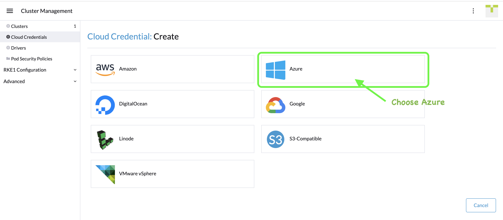
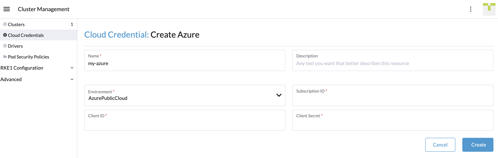
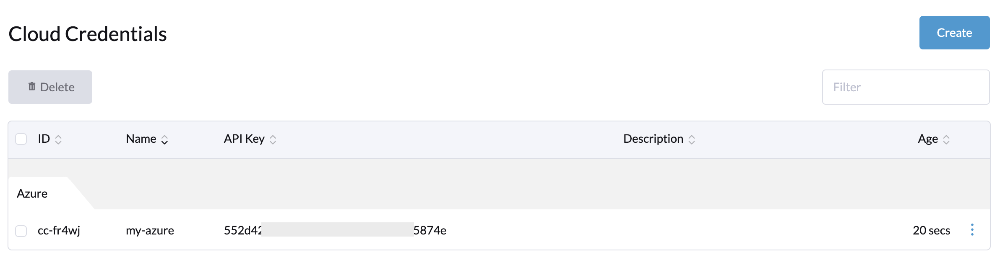

# Exercise 2: Provision Kubernetes on Microsoft Azure within SUSE Rancher

Duration: 30 minutes

At this point, you will configure Rancher to automate VM provisioning on Azure and then deploy Kubernetes on these VMs. We are going to provision a RKE2 cluster using Cluster API within SUSE Rancher.

## Task 1: Setup Cloud Credentials

In this task, ...


1. Click the top left 3-line bar icon to expand the navigation menu. Click **Cluster Management** menu item.


2. Click **Cloud Credentials** on the left menu and click **Create** button to visit the page below. Select **Azure** to continue.




3. Create a new cloud credential for your Azure environment with the following details.
   1. Name: my-azure
   2. Subscription ID:
   3. Client ID:
   4. Client Secret:





4. After created, your cloud credential will be on the list as shown as example below.




## Task 2: Provision RKE2 on Azure VMs

In this task, ...


2. Click **Create** button on the **Cluster Management** page.


3. On **Create Cluster** page, toggle the switch to indcate that we are going to deploy RKE2. Then, choose **Azure** to continue.


4. Cluster name: **my-rke2**
5. Machine Pools
   1. Pool Name: **master**
      1. Machine Count: **1**
      2. Roles: **etcd, Control Plane**
      3. Location: **SouthEastAsia**
      4. Resource Group: **Rancher**
      5. Availability Set: **rke2-masters-as**
      6. VM Size: **Standard_B2ms**
      7. (Show Advanced)
         1. Fault Domain Count: **2**
         2. Update Domain Count: **3**
         3. Subnet: **rke2-subnet**
         4. Subnet Prefix: **10.0.1.0/24**
         5. Virtual Network: **mylab-vnet**
         6. Public IP Options: **Static Public IP**
         7. Network Security Group: **(Clear default and Leave Empty)**
   2. Pool Name: worker
      1. Machine Count: **2**
      2. Roles: **Worker**
      3. Location: **SouthEastAsia**
      4. Resource Group: **Rancher**
      5. Availability Set: **rke2-workers-as**
      6. VM Size: **Standard_B2ms**
      7. (Show Advanced)
         1. Fault Domain Count: **2**
         2. Update Domain Count: **3**
         3. Subnet: **rke2-subnet**
         4. Subnet Prefix: **10.0.1.0/24**
         5. Virtual Network: **mylab-vnet**
         6. Public IP Options: **Static Public IP**
         7. Network Security Group: **(Clear default and Leave Empty)**
   3. Click Create button to start provisioning.


[It]: 
[]: 


**Debugging Tips**: Turn on log console to watch the activities on SUSE Rancher while provisioning RKE on Azure VM instances.


Using Cluster API command line with SUSE Rancher


```bash
$ kubectl get cluster.management -n fleet-default
NAME           AGE
c-m-nt94tp6f   18m
local          50m
```


```bash
$ kubectl get cluster.cluster -n fleet-default
NAME     PHASE
my-rke   Provisioned
```


```bash
$ kubectl get machines -n fleet-default
NAME                             PROVIDERID                            PHASE          VERSION
my-rke-master-b7899855b-z8r2h    rke2://my-rke-master-a78352d0-cqjkn   Running
my-rke-worker-5d9f464975-ppn8s                                         Provisioning
my-rke-worker-5d9f464975-xrzsh                                         Provisioning
```


### Next steps

In this exercise, you deployed Rancher Server instance.


