# Exercise 5 Continous Deployment (Fleet)

What is Fleet ?

Fleet is GitOps at scale. Fleet is designed to manage up to a million clusters. It’s also lightweight enough that it works great for a [single cluster](https://fleet.rancher.io/single-cluster-install/) too, but it really shines when you get to a [large scale.](https://fleet.rancher.io/multi-cluster-install/) By large scale we mean either a lot of clusters, a lot of deployments, or a lot of teams in a single organization.

Fleet comes preinstalled in Rancher and is managed by the **Continous Delivery** option in the Rancher UI.

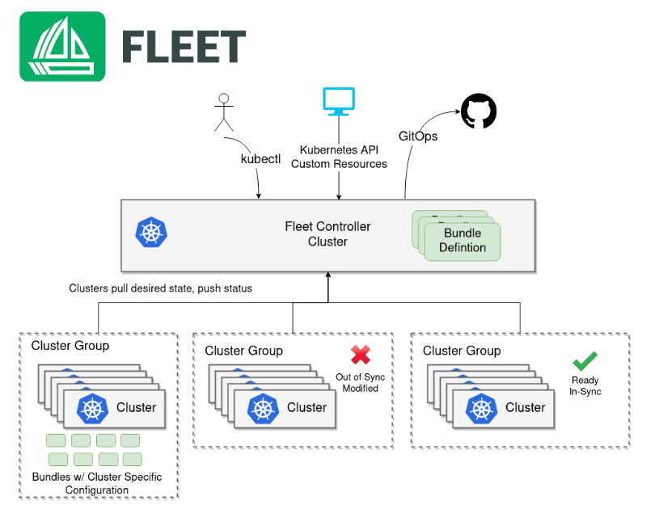

## Task 1 - Setup Rancher Continuous Delivery (CD)

1. Click the top left 3-line bar icon to expand the navigation menu. Click **Continuous Delivery** menu item.

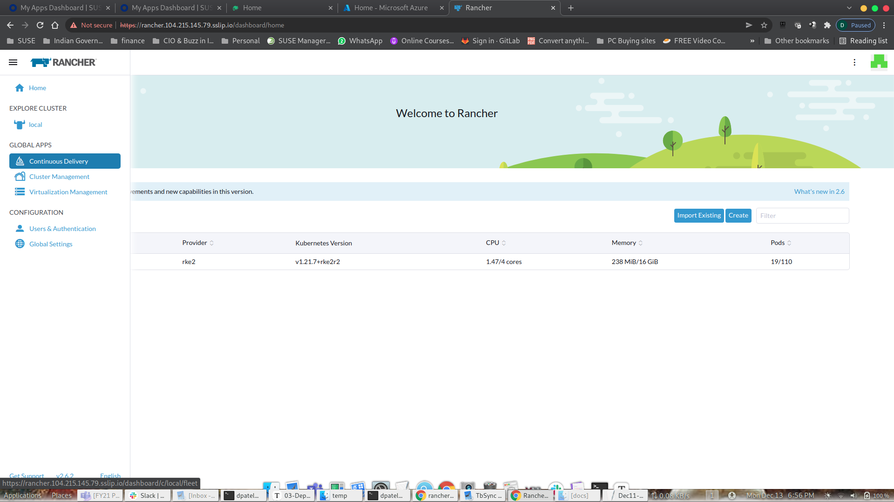

Before we proceed, let's verify if we can see all our cluster in Continuous Delivery

2. Create a Cluster Group
   1. Under Continious Delivery, navigate to `Cluster Group` and click on `Create`. Give it a name of your choise.
   2. Under Cluster Selector provide the following values Key:`distro` Operator: `in list` Value:`rke2`
   3. Rancher Fleet will use the key: value pair to match to clusters to identify the cluster to be associated with newly created Cluster Group in Rancher Continious Delivery. 
   4. Click on `save` which will create our first Cluster Group.

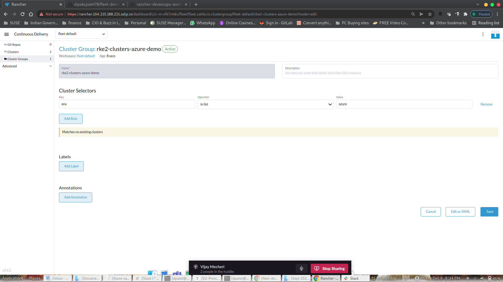

We don't see any cluster matching the label as our cluster (RKE2), we haven't set any cluster labels. Once you apply the cluster with the cluster labels, it would match & provide the result matching.

In order for us to set label to RKE2 cluster

1. Click the top left 3-line bar icon to expand the navigation menu. Click **Cluster Management** menu item.
2. Click on the 3 Vertical dots to Edit the config of the RKE2 cluster
3. Head to teh Cluster Configuration - Labels and Annotations Page
4. Under Labes provide key:value pair. In our case **Key:`distro`**  and **Value: `rke2`**


## Task 2 - Configure Git Repo

In previous exercise, we have configured stateful application. In this exercise, you will configure a simple stateless web  application which will spin up 2 container Pod with Rancher logo. The application is available at GitHub.

1. In Rancher UI > `Global Apps` > `Continous Delivery` > `Git Repos` click on `Create` 
2.  Give a name to your Git Rep `Name` 
3. Paste the Git Repo URL in `Repository URL`
4. In the Branche Name type `main` 
5. Use the dropdown option and select the Cluster Group we created previosuly
6. Provide a Namespace `default`

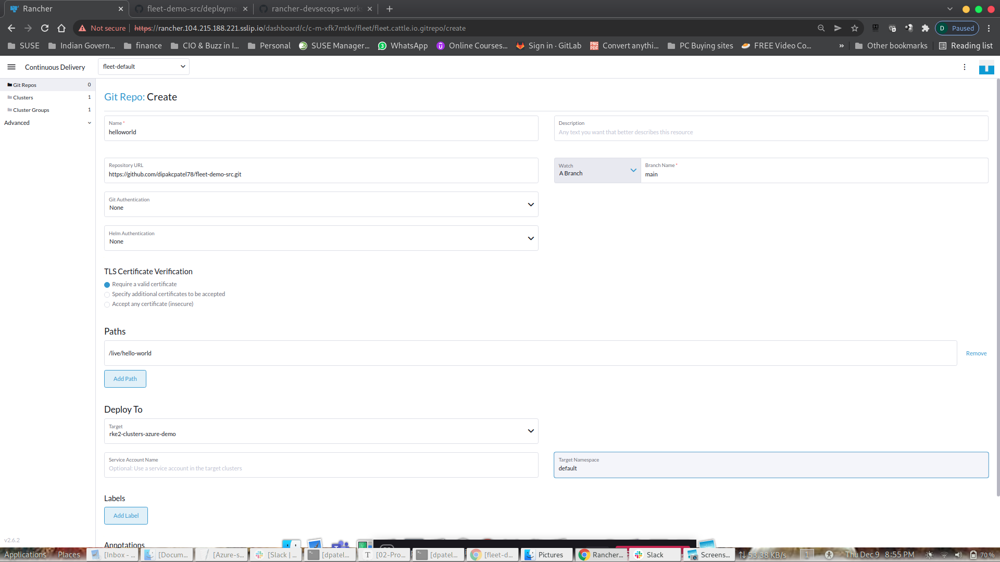

You have successfully completed Rancher Continuous Delivery configuration.

Fleet will now watch the code/configuration in GitHub & any changes will be picked up & be deployed on the target cluster cluster assigned to the Git Repo. 

Once the Git Repo is created, it will initate the reconciliation

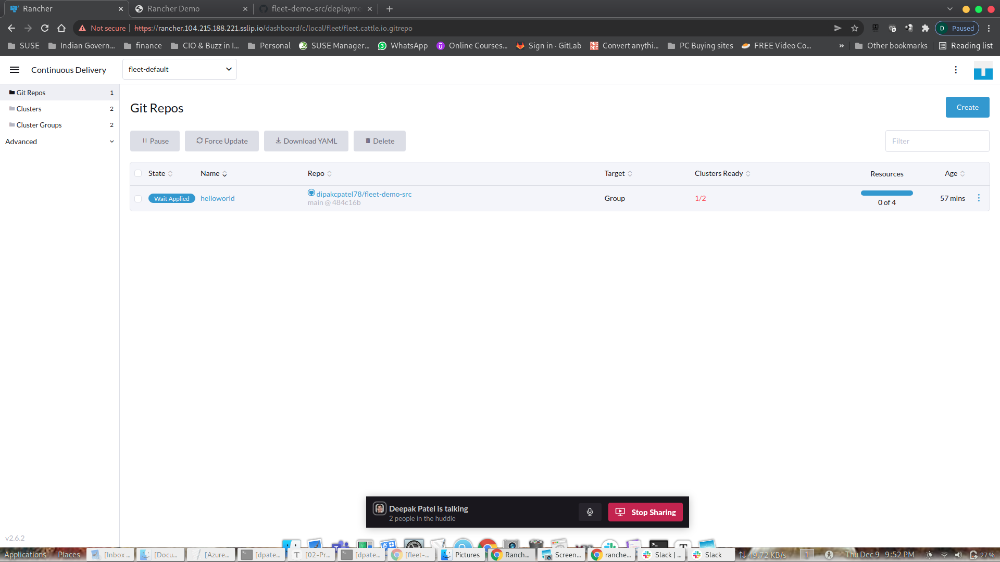

Once the reconciliation is completed, you can observe the Deployment, Pod & the Services section of the RKE2 Cluster for the App. 

Deployment/Pods in default Namespace


Deployment/Pods - Services Discovery - Services - Default Namespace

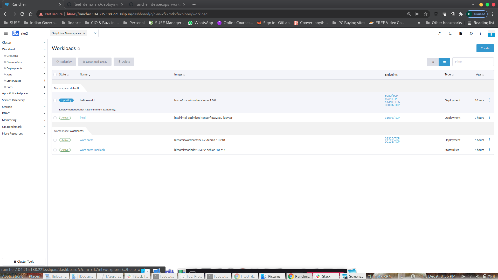

Click on the Nodeport & the application would open a new browser window

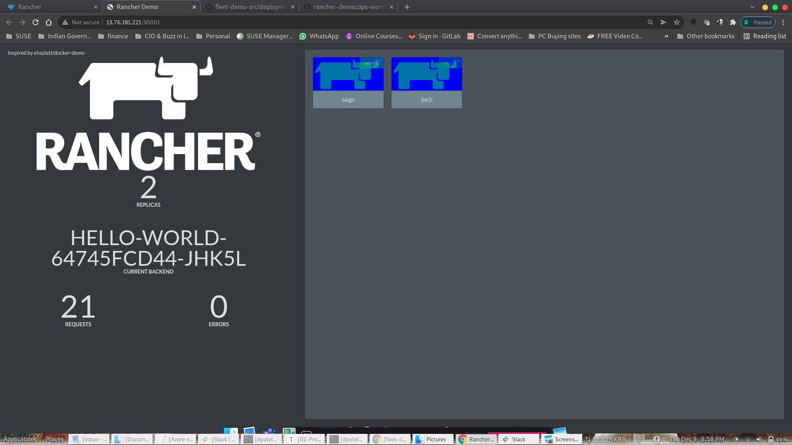

Now we have our Application Deployed & Running. 

Customer would seek new features/services/provide feedback for our Software/Services. To incorporate changes we will need to make changes as necessary. With Continuous Integration (CI)/ Continuous  Deployment (CD) process, we can quickly act of the changes expected, test & roll out the changes quickly to market. 

Let's see how we can use CI & make use of CD to quickly rollout the changes.

**Note: This part will require you to have your own GitHub Account. You will need to fork the repo to you own account & make changes locally.**

Login to personal GitHub Account. You will see your GitHub ID on the Left Top Corner. Mine is ready ***<!--dipakcpatel78-->***.  You will have your own ID name reflecting. 


In the GitHub Search for "dipakcpatel78/fleet-demo-src"

```
dipakcpatel78/fleet-demo-src
```

Select the repo & you will be taken to the Public Repo. 


Click on Fork Icon on the right hand top corner of the Github page which will for the repo to your own Github account.

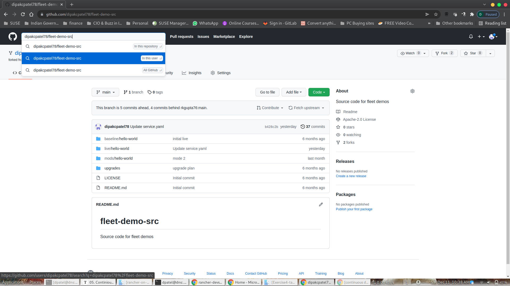

Go to the Folder `'live/hello-world'`  Section & locate `deployment.yaml`

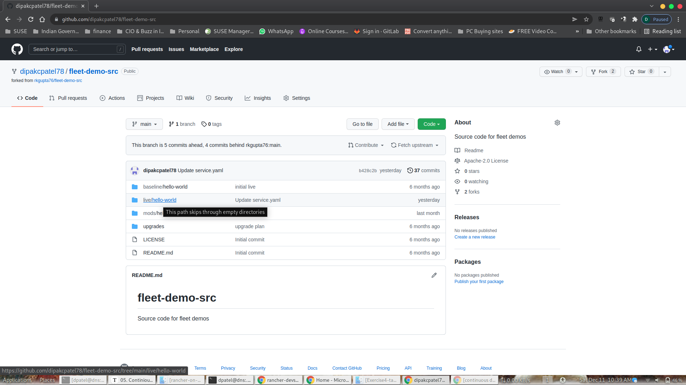

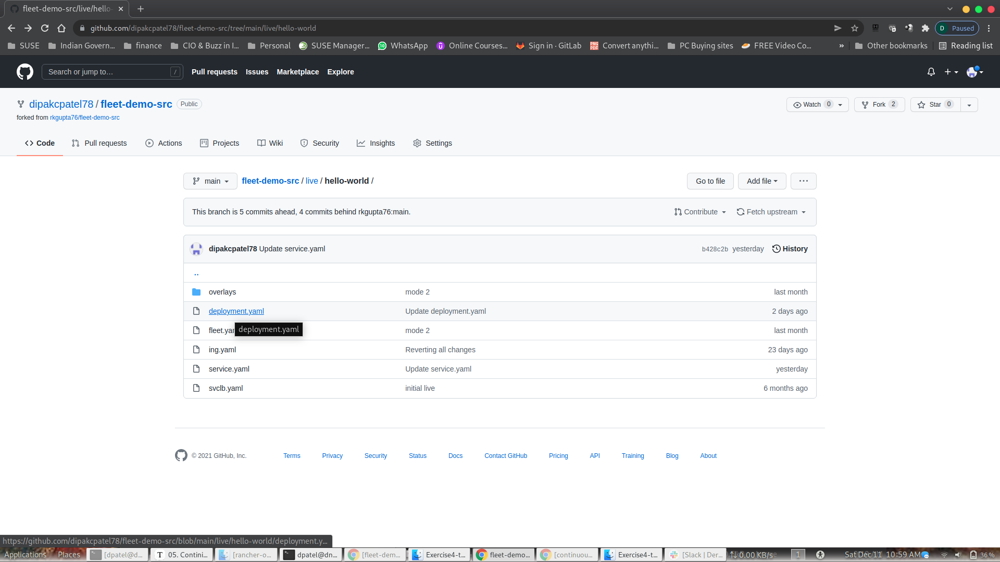

Let's make some simple changes. Let's change the Container Background Color & also increase the Application Container to ensure we meet workload demand.

Clock on the Pencil like Icon to edit the Deployment Definition.

Below is the Deployment definition. Will change 2 lines of our deployments from it's present value to new desired value

Line 7: Replicas: 5

Line 26: value: Green

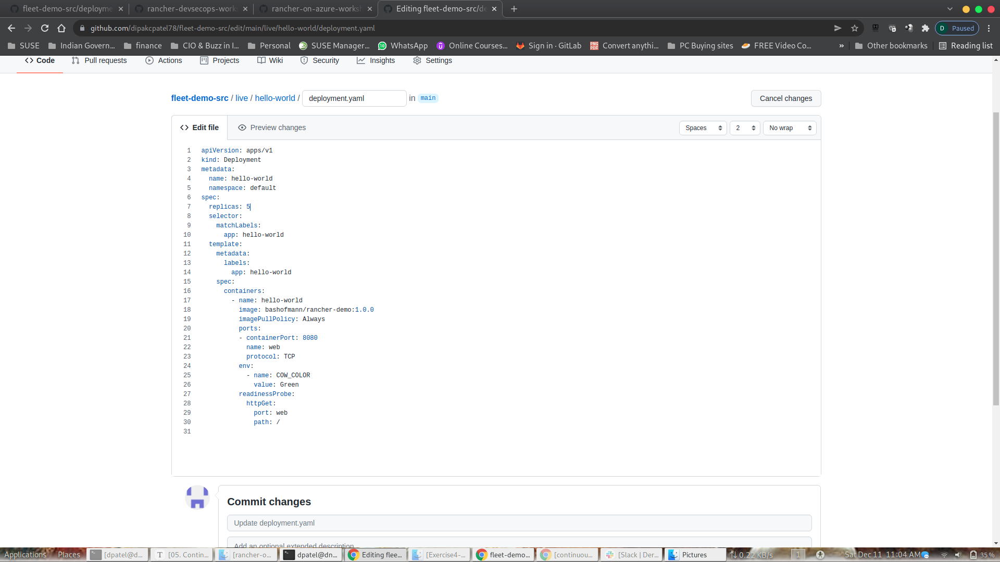

Provide your own description on the commit and save the changes. 

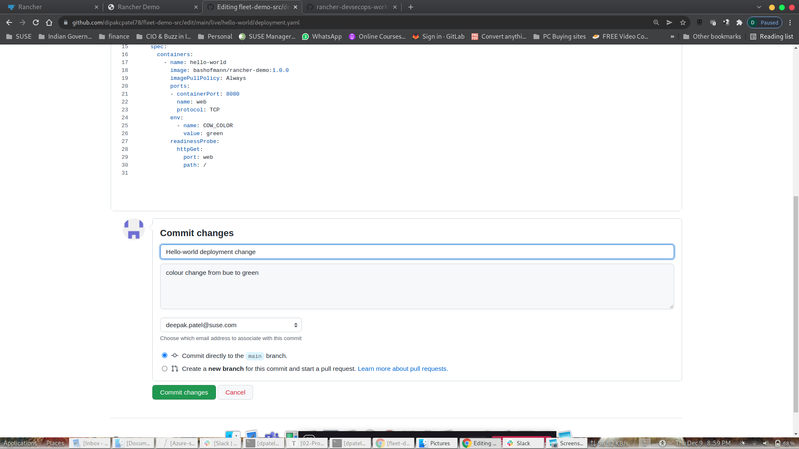


Fleet will pickup any changes on Fleet & reconcile the cluster state. The present deployment due to the changes will not reconcile to increase the Deployment Replica count from 2 to 5, So additional 3 Containers will be created & the background color of the container from Blue will change to Green

Additional container will be spin up to meet the new desired Deployment definition. 

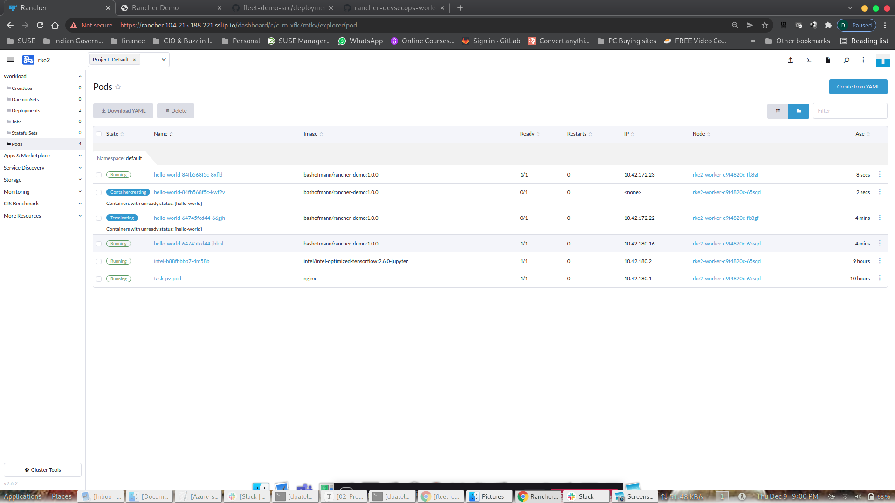

If you observe your browser will see the additional container getting created & the background color changing from Blue to Green. In all you will 5 containers. 

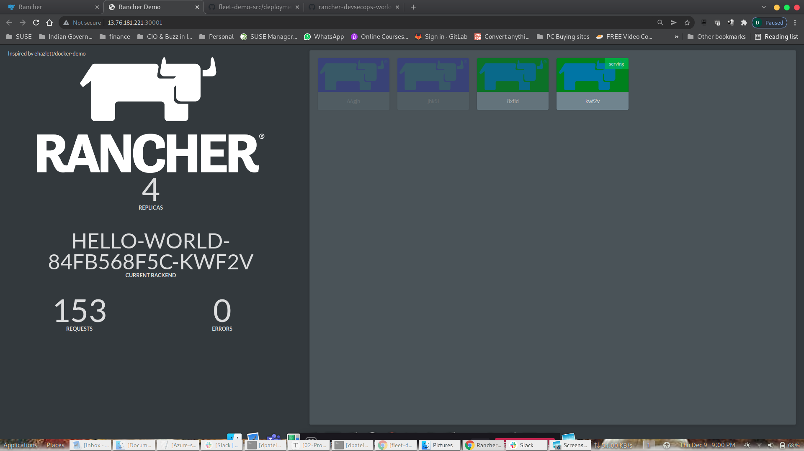

You have successfully made changes to our code in GitHub, Git remain single source of truth.

Congratulation! you have successfully build our CI/CD pipeline with SUSE Rancher for continuous development and delivery. We hope you have enjoyed exploring a little of what Rancher can do to your kubenetes development, deployment, and management.

If you are interested, to explore power of Fleet in DevSecOps world, we have another hands-on workshop we have covered the Application life-cycle using Fleet to more close production like scenario. You can explore it to see how SUSE Rancher integrate easily with Github (Version Control), Jenkins (CI Build Server), Maven (Java Build Tool), Harbor (Container Image Registry), Kaniko (Container Image Builder), Sonarqube (Static Code Analysis) ,  Anchore (Container Image Vulnerability Scanner ).

More details on GitHub Link below.

https://github.com/dsohk/rancher-devsecops-workshop.git

### Next steps

That's the end of the workshop. Hope you enjoy it and do let us know what you think to make this better. If you are interested to explore further how SUSE Rancher can help your organization to transform your business digitally, please reach out to us.


**When you have finished playing with your lab environment go to Part 6 - Cleaning up the lab environment**