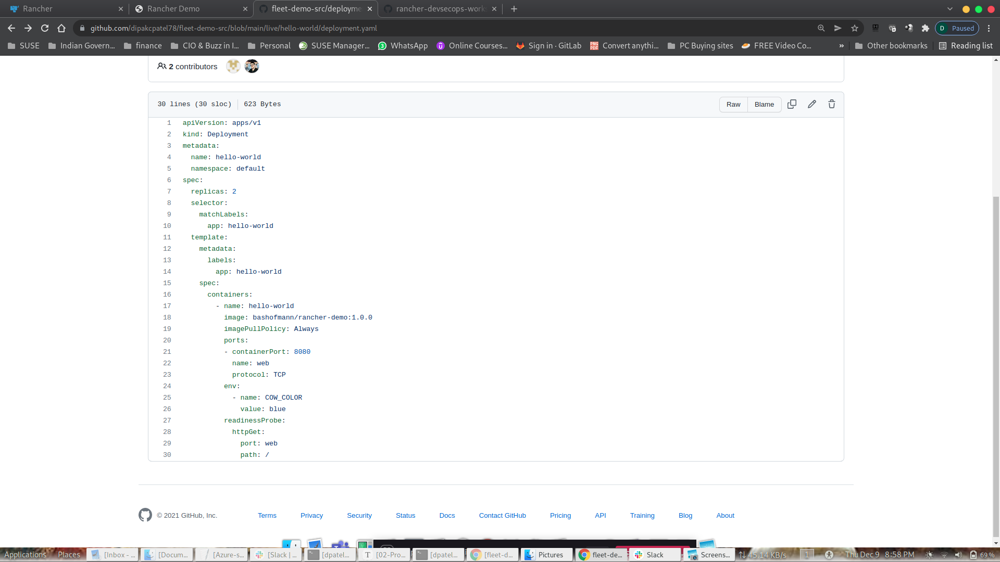
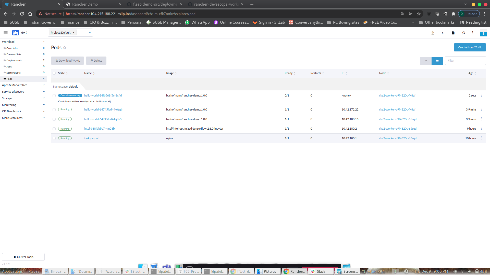
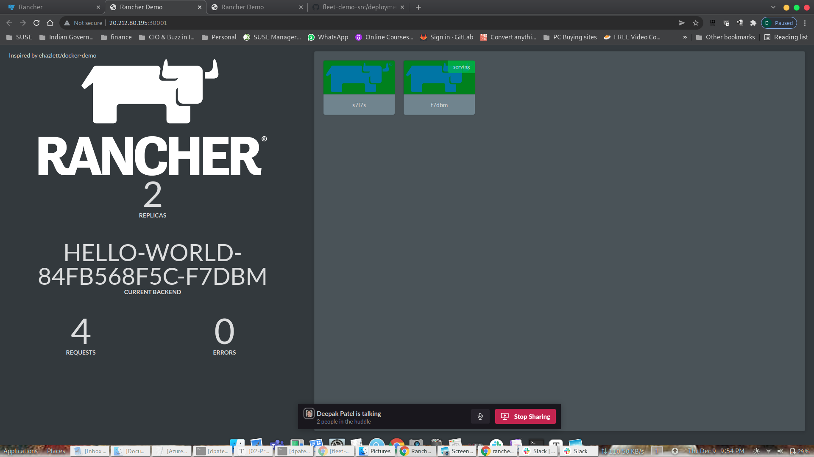

Exercise 4.1: Continous Deployment (Fleet)

Kubernetes within SUSE Rancher 

What is Fleet ?

Fleet is fundamentally a set of Kubernetes custom resource definitions (CRDs) and controllers to manage GitOps for a single Kubernetes cluster or a large-scale deployment of Kubernetes clusters

Fleet in Action

Will have to add image as to how we can reach to Fleet.

Cluster Group

Git Repo

Adding Label to Cluster

Git Repo Reconsiliation

Continious Integration (Code Change)

Code Change. Pod Background from Blue to Green

/Exercise4-Task4-Fleet-Update-Post-Git-Commit.png)

