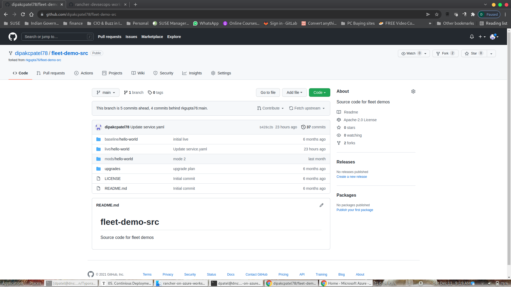
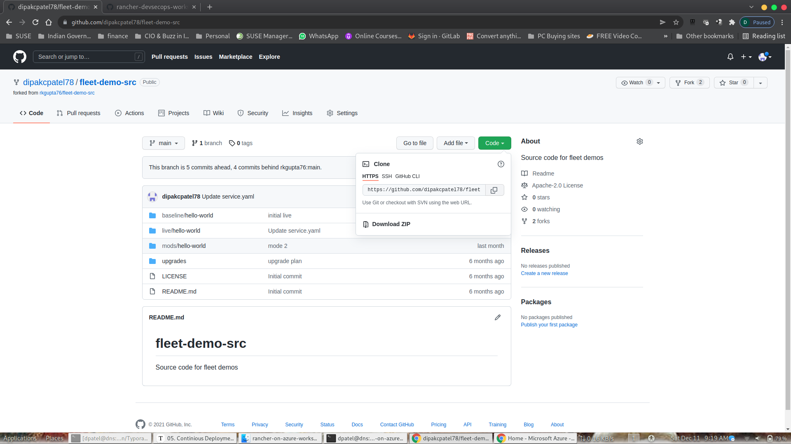

Exercise 5 Continous Deployment (Fleet)

What is Fleet ?

Fleet is fundamentally a set of Kubernetes custom resource definitions (CRDs) and controllers to manage GitOps for a single Kubernetes cluster or a large-scale deployment of Kubernetes clusters


## Rancher Continuous Delivery (CD)

### Configure Rancher Continuous Delivery (CD)

1. Rancher UI > `Global Apps` > `Continuous Delivery`

Before we proceed, let's verify if we can see all our cluster in Continuous Delivery

### Create a Cluster Group

1. Navigate to `Cluster Group` and click on `Create`. Give it a name `development`

Here we are going to use the same Label which was used to create `Cluster1` and `Cluster2`.

1. Under Cluster Selector provide the following values Key:`distro` Operator: `in list` Value:`rke2`

Once you key in the key:value pair, Rancher will use the selector labels to indentify the clusters to be associated with our newly created cluster group in Rancher Continuous Delivery. You will see it show 2/4 cluster been selected.

1. Click on `save` which will create our first Cluster Group.


### Configure Git Repo

Before we ahead for configuring the Git Repo, we need to Git Repository URL.

Follow the instruction below to get to Git Repository URL.

1. Click on the Repository URL and you will be taken into the `code` tab. In the code tab, you will be in the `main` branch.

   ```
   https://github.com/dipakcpatel78/fleet-demo-src.git
   ```

   

2. Click on `code` tab, use the drop down menu and you will be presented with the repositroy url. 

3. Click on the clipboard icon to copy the URL from `HTTPS` tab.





1. In Rancher UI > `Global Apps` > `Continous Delivery` > `Git Repos` click on `Create` a) Give a name to your Git Rep `Name` b) Paste the Git Repo URL in `Repository URL`
   c) In the Branche Name type `main` d) Use the dropdown option and select the Cluster Group we created previosuly `rke2-clusters-azure-demo`. e) Provide a Namespace `default`

Sample output of the GitRepo configuration below


Since we haven't yet added the desire cluster label to match the newly created cluster group, we will now add cluster label.

Adding Label to Cluster


You have successfully completed Rancher Continuous Delivery configuration.


Git Repository Reconciliation


Once the reconciliation is completed, you can observe the Deployment, Pod & the Services section of the RKE2 Cluster for the App. 

Deployment/Pods in default Namespace


Deployment/Pods - Services Discovery - Services - Default Namespace


Click on the Nodeport & the application would open a new browser window


Now we have our Application Deployed & Running. 

Customer would seek new features/services/provide feedback for our Software/Services. To incorporate changes we will need to make changes as necessary. With Continuous Integration (CI)/ Continuous  Deployment (CD) process, we can quickly act of the changes expected, test & roll out the changes quickly to market. 

Let's see how we can use CI & make use of CD to quickly rollout the changes.

**Note: This part will require you to have your own GitHub Account. You will need to fork the repo to you own account & make changes locally.**

Login to personal GitHub Account. You will see your GitHub ID on the Left Top Corner. Mine is ready ***<!--dipakcpatel78-->***.  You will have your own ID name reflecting. 


In the GitHub Search for "dipakcpatel78/fleet-demo-src"

```
dipakcpatel78/fleet-demo-src
```

Select the repo & you will be taken to the Public Repo. 


Click on Fork Icon on the right hand top corner of the Github page which will for the repo to your own Github account.


Go to the Folder `'live/hello-world'`  Section & locate `deployment.yaml`


Let's make some simple changes. Let's change the Container Background Color & also increase the Application Container to ensure we meet workload demand.

Clock on the Pencil like Icon to edit the Deployment Definition.

Below is the Deployment definition. Will change 2 lines of our deployments from it's present value to new desired value

Line 7: Replicas: 5

Line 26: value: Green


Provide your own description on the commit and save the changes. 


Fleet will pickup any changes on Fleet & reconcile the cluster state. The present deployment due to the changes will not reconcile to increase the Deployment Replica count from 2 to 5, So additional 3 Containers will be created & the background color of the container from Blue will change to Green

Additional container will be spin up to meet the new desired Deployment definition. 


If you observe your browser will see the additional container getting created & the background color changing from Blue to Green. In all you will 5 containers. 


You have successfully made changes to our code in GitHub, Git remain single source of truth.

Congratulation! you have successfully build our CI/CD pipeline with SUSE Rancher for continuous development and delivery. We hope you have enjoyed exploring a little of what Rancher can do to your kubenetes development, deployment, and management.

If you are interested, to explore power of Fleet in DevSecOps world, we have another hands-on workshop we have covered the Application life-cycle using Fleet to more close production like scenario. You can explore it to see how SUSE Rancher integrate easily with Github (Version Control), Jenkins (CI Build Server), Maven (Java Build Tool), Harbor (Container Image Registry), Kaniko (Container Image Builder), Sonarqube (Static Code Analysis) ,  Anchore (Container Image Vulnerability Scanner ).

More details on GitHub Link below.

https://github.com/dsohk/rancher-devsecops-workshop.git

**When you have finished playing with your lab environment go to Part 6 - Cleaning up the lab environment**